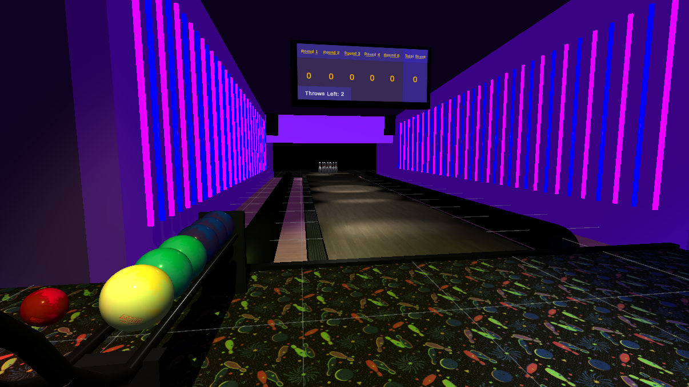

# Regular Boring Bowling

Regular Boring Bowling might not be as Regular and Boring as the name suggests, but it sure does contain a lot of bowling. And by bowling we mean suped up bowling using bazookas, speedboosts, holes, moving obstacles and much more. The game lets you play how you like, giving you a regular and boring bowling experience as a baseline, but having an arsenal of tools by your side and different increasingly difficult levels to complete. On top of items to shoot the balls, the balls themselves have their own powers. Some bounce like crazy, some ignore gravity and others might be as heavy as a truck.

## Game Features:
- Bowling
- Disco (Selfmade "Banger" Soundtrack)
- Bazooka Bowling
- Bowling with extra steps (Extra levels and Balls that would not work in reality)
- Point System (Celebration when striking!)

## Requirements:
- Download Unity Version: 2022.3.9f1
- VR Headset: Tested on Quest 2

